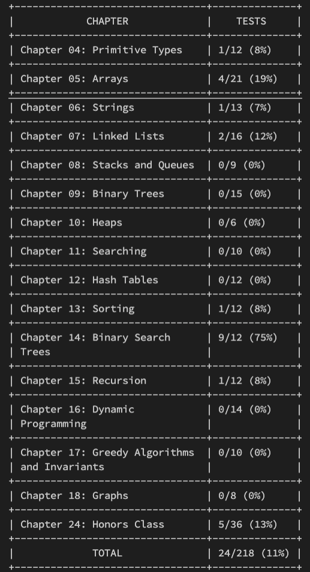
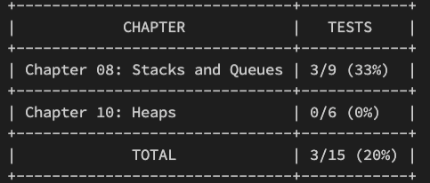
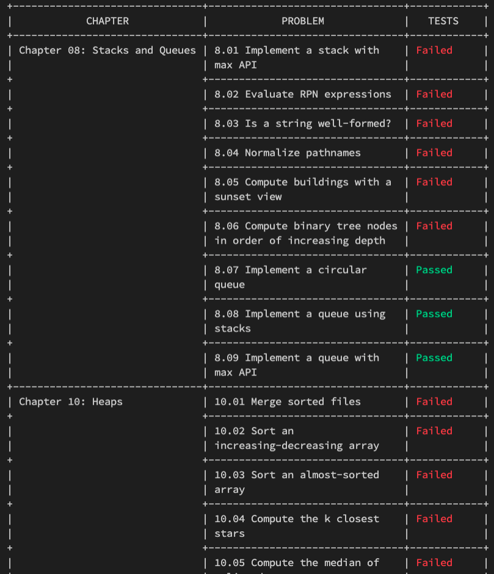

# EPI Judge Golang / Elements of Programming Interview Golang Judge

Test tools for the Go solutions of the problems from ["Elements of Programming Interview"](https://elementsofprogramminginterviews.com/)

## Introduction

EPI Judge Golang is a tool that attempts to offer for Go what [the original EPI Judge](https://github.com/adnanaziz/EPIJudge) offers for C++, Java and Python:
- stub programs
- test cases

These allow to validate that a solution (implemented in Go) to one of the EPI problem passes all the tests included in the original EPI Judge.

## Background

EPI stands for ["Elements of Programming Interview"](https://elementsofprogramminginterviews.com/), a book with algorithmic problems and solutions, a great tool for anyone preparing for programming interviews, learning algorithms or just enjoying tricky programming challenge. If you don't know it, check it out [here](https://elementsofprogramminginterviews.com/). The authors of the book also offer a free online tool for testing your solution called [EPI Judge](https://github.com/adnanaziz/EPIJudge).

The original book series don't cover Go, and the original EPI Judge doesn't offer a framework for solving problems and testing the solutions in Go. This is where this repository comes in, offering a Golang version of the EPI Judge.

## Installation

Clone or fork this repository:

```sh
git clone https://github.com/stefantds/go-epi-judge
```

Clone the original EPI Judge repository. The EPI Judge Golang uses the tests cases defined in tsv files in the original EPI Judge repository. These files are not duplicated in this repository but are needed for running the tests.

```sh
git clone https://github.com/adnanaziz/EPIJudge
```

In the `go-epi-judge` local repository, create a config file by duplicating `config.example.yml` and call it `config.yml`

```sh
cd ./go-epi-judge
cp config.example.yml config.yml
```

Edit `config.yml` to set the `testDataFolder` property to the absolute path to the `test_data` folder found in the local clone of the original EPI Judge. It should look something like:

```yml
testDataFolder: /Users/stefantds/gitrepos/EPIJudge/test_data
```

## Solving a Problem

All the problems are found in the `epi` folder. Each problem can be found by its name. The problem names are exactly the same as in the book and in the original EPI Judge.
Each problem has its own package in a folder in the `epi` folder. Each of these folders contain the following:
- a `solution.go` file: here is the method that needs to be implemented. Only this file needs to be modified.
- a `solution_test.go` file: it contains the test code that allows to test the solution.
- a `main_test.go` file: it also contains test code, it allows to initialize the test.
- potentially other files with some types needed by the problem.

## Running tests

Tests can be run in the classical Go way. See https://golang.org/pkg/testing/ for more information on flags and options.

Run all test for a particular problem:

```bash
go test ./epi/bst_from_preorder
```

Run all tests for all problems:

```bash
go test ./...
```

Run one particular test for a particular problem:

```bash
go test ./epi/bst_from_preorder -run TestRebuildBSTFromPreorder/Test_Case_0
```

## Multiple Solutions

Multiple solutions for the same problem can be tested (assuming the same function signature). This covers the case where several solution are implemented and all should be tested against the provided test cases.
In order to add more functions to the ones to be tested, identify in the corresponding test file the array of solutions at the beginning of the file and add all the functions (or stucts in some cases) that need to be tested.

E.g. (in `epi/count_bits/solution_test.go`):

```
var solutions = []solutionFunc{
	CountBits,
	CountBitsV2,
}
```

## Parallel Testing

Running test cases in parallel is supported and can be enabled or disabled by the property `runParallelTests` in `config.yml` (which enables or disables the call to `t.Parallel()` for every test case). Running test cases in parallel can increase the test speed considerably. However, the test cases are then run in a random order which, together with the parallel aspect, can make debugging difficult. Therefore, it can be easily enabled or disabled.

## Test Timeout

It often makes sense to limit the execution time of tests to a reasonable amount of time. This allows to catch cases like infinite loops or too high complexity algorithms.
This can be easily achieved with the default Go testing tools, by using the timeout parameter:

```sh
go test ./epi/nonuniform_random_number -timeout 30s
```

## Progress Tracking

In order to track the progress, a CLI tool is included in this repository. The original EPI Judge has a similar tool (but presented as a HTML page).

```
Usage: ./progress [options] [chapter_nb ...]

Options:
  -d string
        path to epi folder. (default "./epi")
  -v    show detailed test status.
```

### Examples

See progress aggregated per chapter (for all chapters):

```sh
go run ./progress
```



See progress aggregated per chapter (for selected chapters):

```sh
go run ./progress 8 10
```



See progress with details (for selected chapters):

```sh
go run ./progress -v 7 8
```



See progress with details (for all chapters):

```sh
go run ./progress -v
```

Note that running the commands from a different repository requires to additionally pass the path to the `epi` folder as a parameter.
See help for more details:

```sh
go run ./progress -h
```

The progress tracking is relying on some `.progress` files that are being updated when tests are run. However, if the test use cache, the progress files are not updated. In some cases a fresh calculation is desired: just run `go test` for all the problems while disabling cache:

```sh
go test ./... -count=1
```

## FAQ

#### Is this EPI Judge "official"?

No, it's just "fan art". It's a tool that was intended for personal usage but can be useful to anyone. I'm not associated with or backed by the authors of the original EPI Judge.

#### Are solution to problems included?

No, there are no solutions in this repository, as it is intended as a starting point for anyone who wants to solve the EPI problems in Go. But you can find my solutions at https://github.com/stefantds/go-epi-solutions (work in progress).

#### Do the tests offer the same corner-case coverage as the original EPI Judge?

Yes, in the sense that they read the test case files and run the same tests. Also, most of the testing logic follows the test logic from the original EPI Judge. In some cases, small adaptations were made.

#### Is it easy to map problems and solutions between the EPI book and code in this repository?

I had this aspect in mind when working on this repository, therefore:
  - all the problems have exactly the same name as in the original EPI Judge (but use snake case, as it's typical for Go)
  - all the solution functions, parameter names and custom type names have the same names as in the original EPI Judge
  - most of the function signatures are identical to the ones from the original EPI Judge (there are a few exceptions where it made sense to use some Go features, like multiple return values).
This should make it easier to follow the problems and solutions in the book or in the original EPI Judge and solve them in Go with this tool.

#### What to do if a test is wrong?

As I haven't implemented all the solutions to all the problems yet, there might still be some hidden bugs. However, I've tested many of the functions and hope to have found most of the problems. If you find an issue in the test code, please open a ticket.
If you can find the cause of the problem and know how to fix it, feel free to open a pull request. If you are not sure, we can first discuss the different options in the ticket.

## Contributing

Pull requests are welcome. Please open an issue first to discuss what you would like to change.

## License

[MIT](https://choosealicense.com/licenses/mit/)
